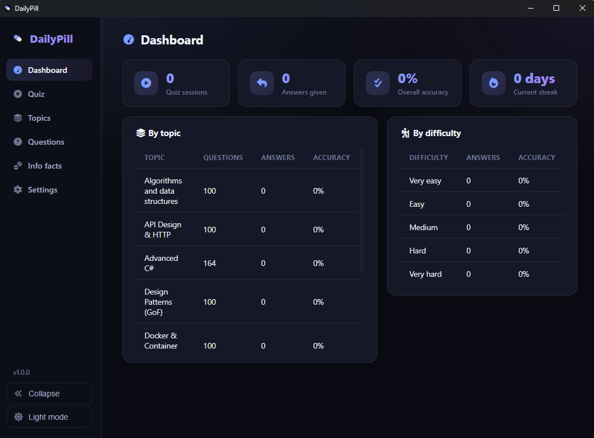
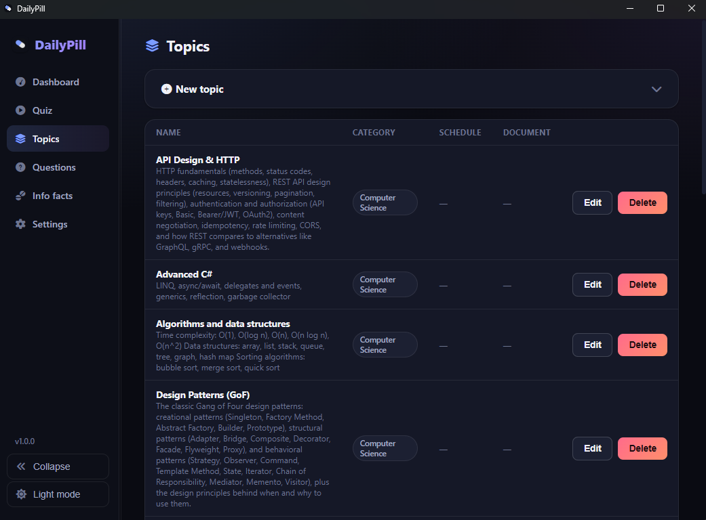
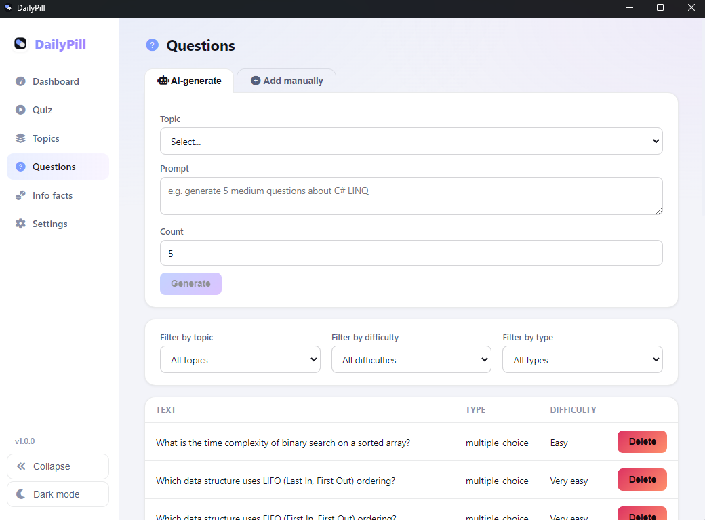
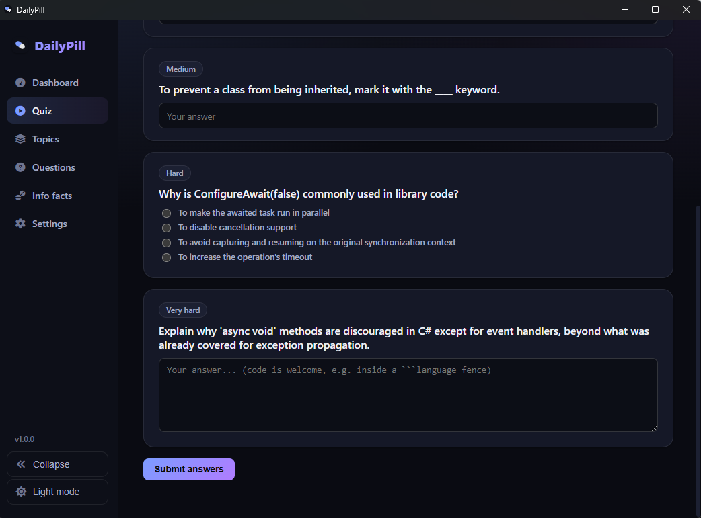

A **Windows desktop app** that keeps your knowledge fresh with short daily quizzes and
once-a-day "info facts" popups, powered entirely by a **local AI (Ollama)**, so nothing
ever leaves your machine.

## Features

- **Dashboard**: quiz history, accuracy by topic and difficulty, current streak, and your
  weakest topics at a glance.
- **Quiz**: take a quiz on demand, or let a scheduled reminder pop up automatically (a small
  confirmation window, not the full app) at the day/time you configure per topic.
- **Topics**: create topics, attach a `.md` context document so the AI has real material to
  draw from, set weekly quiz schedules, import/export a topic (with its questions/facts) as
  a single YAML file.
- **Questions**: multiple-choice, fill-in-the-blank, single-word, and open-answer/code
  questions — added manually or generated by the local AI from a prompt.
- **Info facts**: mark a topic "informational only" to get a bite-sized fact once a day
  instead of a quiz.
- **Local AI (Ollama)**: generates questions/facts, reviews open-answer/code responses,
  writes an end-of-quiz recap, and lets you chat about the quiz afterward — automatically
  using your GPU (NVIDIA CUDA) when available.
- **Dark/light mode**, a resizable and collapsible sidebar, and a short onboarding tour on
  first launch (replayable anytime from Settings) — all remembered across restarts.
- **Desktop app**: installs like a normal Windows application, starts automatically at
  login, and lives in the system tray instead of cluttering the taskbar.

## Screenshots

|  |  |
| ------------------------ | ------------------------ |
|  |  |

## Getting started

**Prerequisites**: [Node.js](https://nodejs.org/) 18+, [.NET SDK](https://dotnet.microsoft.com/) 10+,
and [Ollama](https://ollama.com/) (optional but strongly recommended — without it, AI features
degrade gracefully instead of crashing).

1. Restore dependencies from the repo root:
   ```powershell
   dotnet restore
   cd frontend && npm install && cd ..
   ```
2. Copy `.env.example` to `.env`, then pull an Ollama model and make sure `OLLAMA_MODEL` in
   `.env` matches the exact tag `ollama list` prints:
   ```bash
   ollama pull llama3.1:8b
   ollama list
   ```
3. Run the backend and frontend (two terminals):
   ```powershell
   # terminal 1
   dotnet run --project DailyPill.Api

   # terminal 2
   cd frontend && npm run dev
   ```
   The database (SQLite) and quiz topics are created/seeded automatically on first backend
   start — no manual setup step needed.
4. The app window starts **hidden** in the system tray (by design) — click the tray icon to
   open it.

If you're working in VS Code, press **Ctrl+Shift+B** ("Run DailyPill (backend + frontend)")
to start both at once, or use the **Run and Debug** panel for backend debugging.

For architecture, the data model, EF Core migrations, build/installer instructions, and
troubleshooting, see [code_documentation.md](code_documentation.md).
